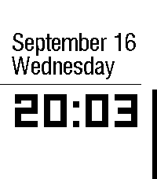
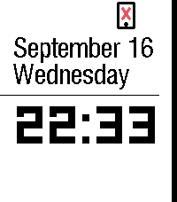
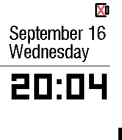
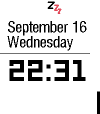

# Void Clock - Minimalist High-Contrast Watchface

Born from the legacy of ClockLight (a decade in the making), Void Clock is
a high-contrast minimalist watchface designed for the focused. It strips
away the noise to display only what matters: the time, date, weekday,
battery level, Bluetooth connection status, and Quiet-Time indicator.

Clean, essential, and relentlessly functional.

## Screenshots

<table>
  <tr>
    <td align="center">
      
        
      <b>Normal State</b>
    </td>
    <td align="center">
      
        
      <b>Bluetooth Disconnected</b>
    </td>
    <td align="center">
      
        
      <b>Battery Empty</b>
    </td>
    <td align="center">
      
        
      <b>Quiet Mode</b>
    </td>
  </tr>
</table>

## Changelog

### 1.0.4 - Procedural Warning Icons

- **Changed** Bluetooth and empty-battery icons from PDC resources to
  procedural C drawing — zero external assets, fully anti-aliased on Emery.
- **Changed** Bluetooth disconnected icon: redesigned with thin phone outline
  (18×28 px), centered red X (12×12 px), and small home button — two-color
  black + red design, fully procedural.
- **Changed** Empty battery icon layer bounds 24×18 → 32×36 for consistency
  with other status icons (added 2 px padding on all sides for stroke-bleed
  margin; icon drawing unchanged).
- **Changed** Empty battery warning threshold from 5 % to 10 % — earlier
  warning gives users more time to charge before shutdown.
- **Added** Quiet mode "Zzz" icon (also procedural, 24×32).

### 1.0.3 - Quiet Mode Indicator

- Added: Silent mode "Zzz" icon shown when Pebble Quiet Time is active.
  Two-color black + red design, consistent with existing warning icons.
- Changed: Poll `quiet_time_is_active()` once per minute (SDK v4.33
  provides no subscription service for Quiet Time).

### 1.0.2 - Redesigned Warning Icons

- **Changed** Bluetooth disconnected icon: bigger (24x32), bolder strokes,
  two-color design — black phone shape with red diagonal slash.
- **Changed** Empty battery icon: bigger (24x18), bolder strokes,
  two-color design — black battery outline with red X.
- **Changed** icon layer positions in `src/layers.c` to accommodate
  larger dimensions.

### 1.0.1 - Bluetooth Connection Stability Hotfix

- **Added** 15-second Bluetooth disconnect debounce to prevent spurious
  "no Bluetooth" icon flashing caused by PebbleOS standby mode
  power-management (especially on Pebble Time 2 / Emery).
- **Added** live re-check in the debounce timer — verifies the actual
  connection state before showing the icon.
- **Removed** per-minute Bluetooth resync from the time tick to respect
  PebbleOS v4.30.0 "fewer background wakeups" battery optimization.
- **Fixed** missing `connection_service_unsubscribe()` in window unload
  (resource leak).
- **Fixed** missing `bt_debounce_cancel()` teardown — pending timers are
  now cancelled on app exit.
- **Removed** unused `setToReady()` / `isInitialized` state (dead code
  cleanup).
- **Added** inline firmware timeline comments documenting the root cause
  across PebbleOS releases (core35 → v4.9.175 → v4.31.1).

### 1.0.0 - Initial Release

- Migrated from ClockLight project.
- Emery (Pebble Time 2) platform support only.
- Displays time, date, weekday, battery level, and Bluetooth connection
  status.
- High-contrast LECO 60 font for time; custom Milford font for
  date/weekday.
- Battery bar and empty-battery indicator.
- No-Bluetooth icon with emulator test scripts.
